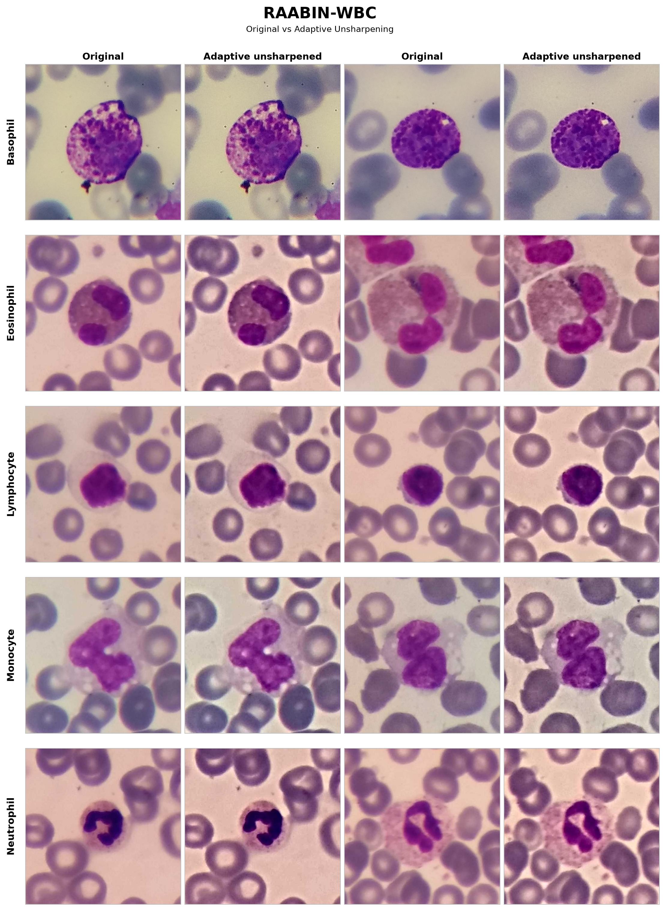
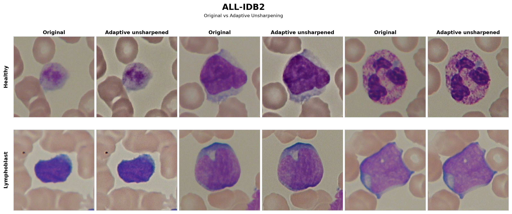

<div align="center">

# 🧬 Adaptive Unsharpening for Blood Cell Analysis

### MATLAB and PyTorch implementations of adaptive focus-aware image enhancement and deep learning for blood-cell classification

[](https://www.mathworks.com/products/matlab.html)
[](https://pytorch.org/)
[](https://www.python.org/)
[](LICENSE)
[](https://ieeexplore.ieee.org/document/9414362)
[](https://iebil.di.unimi.it/cnnALL/index.htm)

**Source code for the ICASSP 2021 paper**  
*Acute Lymphoblastic Leukemia Detection Based on Adaptive Unsharpening and Deep Learning*

</div>

---

## 🧠 Overview

This repository contains the original **MATLAB implementation** and a newer **Python/PyTorch implementation** of the adaptive unsharpening framework introduced in our ICASSP 2021 paper.

The method improves microscopic blood-cell images before classification by combining:

- **focus-quality estimation**;
- **adaptive unsharp masking**;
- **VAR-PCANet / PCANet-based parameter tuning**;
- **pretrained deep CNNs and fine-tuning**;
- **classification and explainability analysis**.

The original work was developed for **Acute Lymphoblastic Leukemia (ALL)** detection on **ALL-IDB2**. The PyTorch implementation additionally supports a modern GPU-oriented workflow and experiments on **RAABIN-WBC**.

---

## ✨ Original vs Adaptive Unsharpening

The adaptive preprocessing increases local detail while preserving the underlying cell morphology.

<div align="center">




</div>

Example comparison on RAABIN-WBC and ALL-IDB2. Each original image is paired with the corresponding adaptively unsharpened version.

---

## 🔬 Method at a Glance

```text
Microscopic blood-cell images
        │
        ▼
Focus-quality estimation
        │
        ▼
Adaptive unsharpening
        │
        ▼
VAR-PCANet / PCANet parameter tuning
        │
        ▼
Deep CNN feature extraction / fine-tuning
        │
        ▼
Classification
        │
        ▼
Blood-cell / leukemia prediction
```

The key idea is to adapt the amount of sharpening to the estimated focus quality of each image instead of applying a fixed sharpening strength to the entire dataset.

---

## 📁 Repository Structure

```text
.
├── imgs/                       # README figures / example outputs
│
├── Matlab/                     # Original MATLAB implementation
│   ├── functions/
│   │   ├── functions_Classifiers/
│   │   ├── functions_DBProc/
│   │   ├── functions_ellipse/
│   │   ├── functions_FeatExtr/
│   │   ├── functions_Freq/
│   │   ├── functions_Gabor/
│   │   ├── functions_Kovesi/
│   │   ├── functions_Orient/
│   │   ├── functions_PCANet/
│   │   ├── functions_preProc/
│   │   └── functions_Reconstruct/
│   ├── libraries/
│   │   ├── lib_1Shot-MaxPol/
│   │   ├── lib_colorNorm/
│   │   ├── lib_FastCMeans/
│   │   ├── lib_FQPath/
│   │   └── lib_StainDeconv/
│   ├── params/
│   ├── steps/
│   └── util/
│
└── PyTorch/                    # GPU-oriented Python/PyTorch implementation
    ├── configs/
    ├── imgs/
    ├── scripts/
    ├── src/
    │   └── cnn_all/
    │       ├── classifiers/
    │       ├── cnn/
    │       ├── data/
    │       ├── focus/
    │       ├── legacy/
    │       ├── pcanet/
    │       └── pipeline/
    └── tests/
```

---

# MATLAB Version

## 🚀 MATLAB Setup

The MATLAB implementation contains the original processing pipeline used for the ICASSP 2021 work.

### Requirements

Typical components include:

- Deep Learning Toolbox
- Image Processing Toolbox
- Statistics and Machine Learning Toolbox
- Parallel Computing Toolbox

The repository also contains the external/supporting libraries used by the original pipeline.

### Run

Open MATLAB from the repository root, move to:

```text
Matlab/
```

and run:

```matlab
launch_CNN_ALL
```

For the newer RAABIN-WBC adaptation, use the corresponding RAABIN launcher if present in your branch.

---

# Python / PyTorch Version

## ⚡ GPU-Oriented Reimplementation

The `PyTorch/` directory contains a modernized implementation designed for GPU execution.

The PyTorch version includes:

- automatic dataset/class discovery;
- focus-score caching;
- adaptive unsharpening;
- GPU PCANet / PCA operations;
- pretrained CNN feature extraction;
- CNN fine-tuning;
- k-NN classification;
- CMC and classification metrics;
- Grad-CAM;
- checkpointing and resume support;
- standalone export of the unsharpened dataset.

The shared preprocessing/focus-tuning stage is computed once and reused across CNN backbones, avoiding unnecessary repeated computation.

## 🐍 Installation

```bash
cd PyTorch

python3 -m venv .venv
source .venv/bin/activate

python -m pip install --upgrade pip setuptools wheel
```

Install a CUDA-enabled PyTorch build appropriate for your system, then install the project:

```bash
pip install -e .
```

Verify the installation:

```bash
cnn-all doctor
```

---

## 📂 Dataset Structure

### RAABIN-WBC

```text
PyTorch/
└── imgs/
    └── orig/
        └── Raabin-WBC/
            ├── Basophil/
            ├── Eosinophil/
            ├── Lymphocyte/
            ├── Monocyte/
            └── Neutrophil/
```

### ALL-IDB2

```text
ALL_IDB2/
├── 0/
└── 1/
```

with:

```text
0 -> Healthy
1 -> Lymphoblast
```

Dataset paths and experiment settings are configured through YAML files in:

```text
PyTorch/configs/
```

---

## ▶️ Running the PyTorch Pipeline

From the `PyTorch/` directory:

```bash
source .venv/bin/activate
```

Run the full pipeline:

```bash
cnn-all run --config configs/raabin_wbc.yaml
```

Or run it phase-by-phase:

```bash
cnn-all prepare --config configs/raabin_wbc.yaml
cnn-all focus-cache --config configs/raabin_wbc.yaml
cnn-all shared --config configs/raabin_wbc.yaml
cnn-all networks --config configs/raabin_wbc.yaml
cnn-all export --config configs/raabin_wbc.yaml
```

For remote execution:

```bash
nohup cnn-all run --config configs/raabin_wbc.yaml > raabin_run.log 2>&1 &
```

Monitor with:

```bash
tail -f raabin_run.log
```

---

## 🧪 Supported CNN Backbones

The current PyTorch implementation supports:

- AlexNet
- VGG16
- VGG19
- ResNet18
- ResNet50
- ResNet101
- DenseNet201

The same original and adaptively unsharpened train/test splits can be reused across all backbones for a fair comparison.

---

## 📊 Expected Outputs

| Output | Description |
|---|---|
| Classification results | Accuracy and related classification metrics |
| Original vs unsharp comparison | Evaluation on the two image versions |
| Focus statistics | Focus-quality values and selected thresholds |
| PCANet features | Learned PCA filters and feature representations |
| Trained CNNs | Fine-tuned network checkpoints |
| Grad-CAM maps | Visual explanation of CNN predictions |
| Logs | Experiment logs and configuration information |
| Exported database | Standalone adaptively unsharpened dataset |

---

## 🧩 Included and Related Libraries

The MATLAB implementation includes or builds upon code and concepts from:

- **PCANet**  
  T. Chan, K. Jia, S. Gao, J. Lu, Z. Zeng, and Y. Ma,  
  *PCANet: A Simple Deep Learning Baseline for Image Classification?*  
  IEEE Transactions on Image Processing, 2015.

- **1Shot-MaxPol**  
  M. S. Hosseini and K. N. Plataniotis,  
  *Convolutional Deblurring for Natural Imaging*,  
  IEEE Transactions on Image Processing, 2019.

- **FQPath**  
  M. S. Hosseini et al.,  
  *Focus Quality Assessment of High-Throughput Whole Slide Imaging in Digital Pathology*,  
  IEEE Transactions on Medical Imaging, 2020.

- **Fast N-D Grayscale Image Segmentation with c-/Fuzzy c-Means**

- **Stain Deconvolution / SCD_FastICA**

- **Comprehensive Colour Image Normalization**  
  G. Finlayson, B. Schiele, and J. L. Crowley, ECCV 1998.

---

## 📚 Paper

If you use this code, please cite:

```bibtex
@InProceedings{icassp21,
  author    = {A. Genovese and M. S. Hosseini and V. Piuri and K. N. Plataniotis and F. Scotti},
  title     = {Acute Lymphoblastic Leukemia Detection Based on Adaptive Unsharpening and Deep Learning},
  booktitle = {Proc. of the 2021 IEEE Int. Conf. on Acoustics, Speech, and Signal Processing (ICASSP 2021)},
  address   = {Toronto, ON, Canada},
  pages     = {1205--1209},
  month     = {June},
  day       = {6--11},
  year      = {2021},
  note      = {ISBN: 978-1-7281-7605-5. DOI: 10.1109/ICASSP39728.2021.9414362}
}
```

Paper:

```text
https://ieeexplore.ieee.org/document/9414362
```

Project page:

```text
https://iebil.di.unimi.it/cnnALL/index.htm
```

---

## 👥 Authors

- **Angelo Genovese**  
  Department of Computer Science, Università degli Studi di Milano, Italy

- **Mahdi S. Hosseini**

- **Vincenzo Piuri**  
  Department of Computer Science, Università degli Studi di Milano, Italy

- **Konstantinos N. Plataniotis**  
  Department of Electrical and Computer Engineering, University of Toronto, Canada

- **Fabio Scotti**  
  Department of Computer Science, Università degli Studi di Milano, Italy

---

## 📄 License

This project is released under the **GNU General Public License v3.0**.

See the [LICENSE](LICENSE) file for details.
